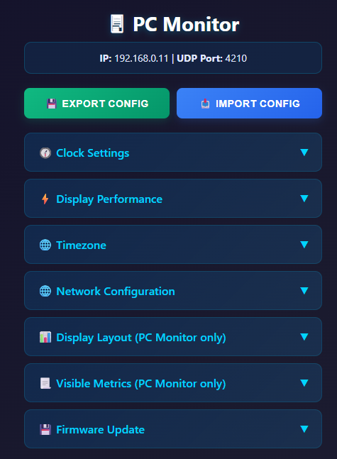
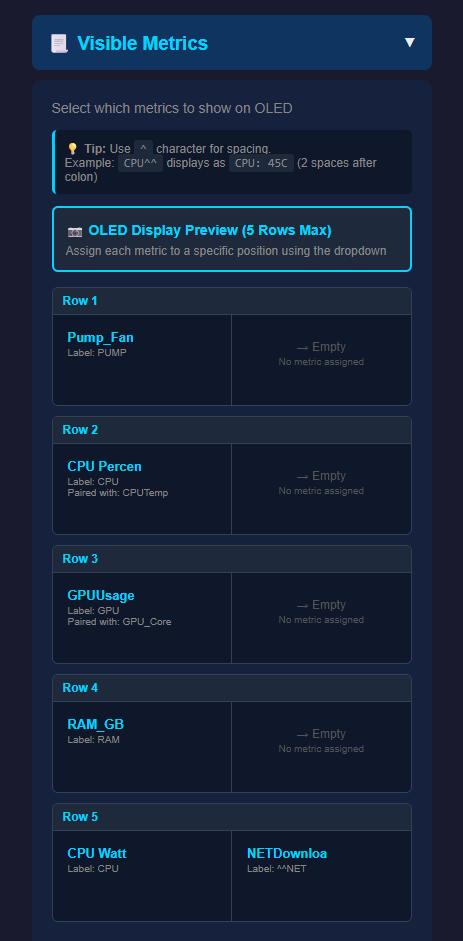
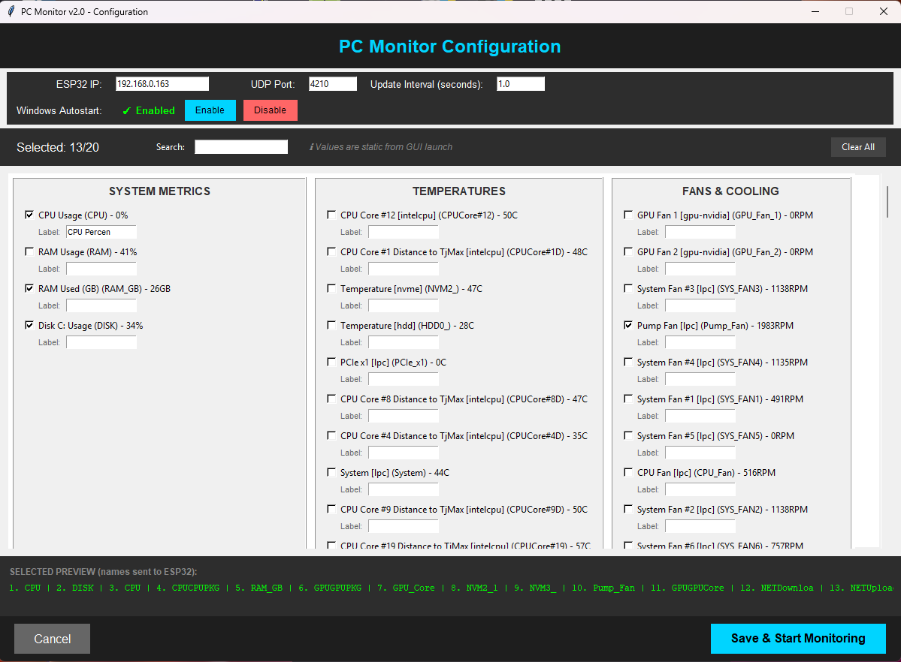
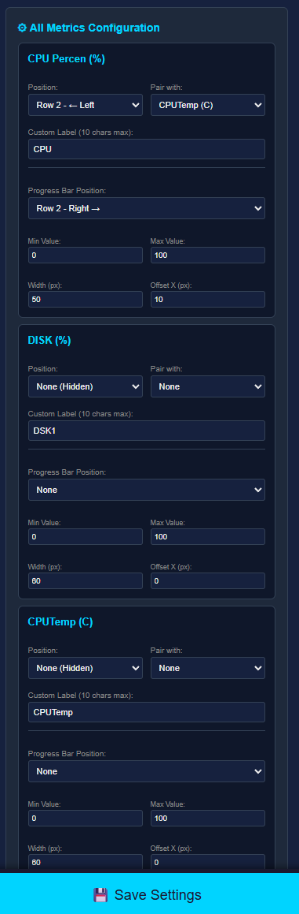
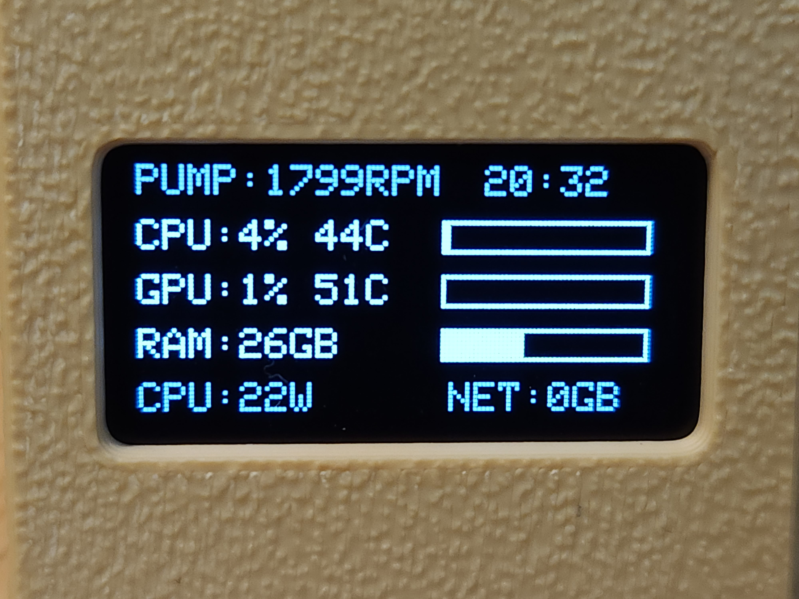
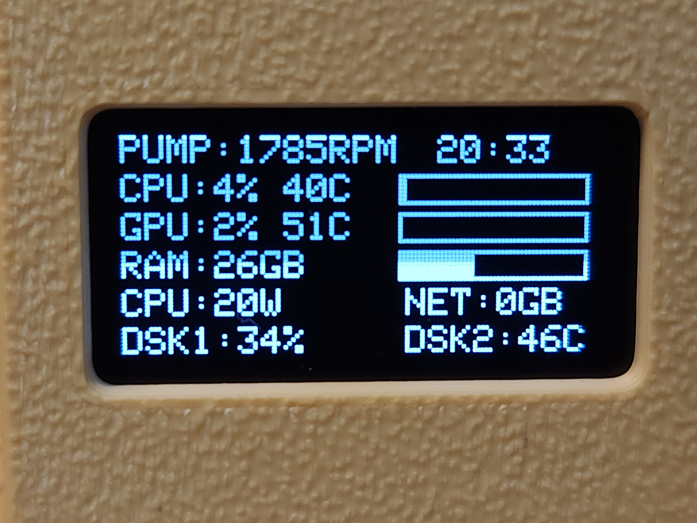

# PC Stats Monitor - ESP32 OLED Display

[](https://www.youtube.com/watch?v=D6zZIyOvWjY)

3D Printable case:
https://makerworld.com/en/models/2051935

Be aware that there are different sizes of the same SSD1306 OLED screen on aliexpress.
Im using this one "Original" version (do not purchase dual color, it won't work): 
https://aliexpress.com/item/1005006262908701.html

ESP32-C3 SuperMini:
https://aliexpress.com/item/1005008988143743.html

I have noticed that some of the cheap ESP32-C3 boards have WiFi related issues on hardware level. After some additional implementations to the code in attempt to fix issues (v1.2.1), some of those issues cannot be fixed as they are on hardware level.
What has helped a bit: Resoldering anthenna to improve connectivity with board, a small capacitor like 220uF or even 10uF between 3.3v and GND pins.
Some of those faluty boards have anthenna too close to other components. Like in this example (left side with 3.5mm gap is better)


A real-time PC monitoring system that displays CPU, RAM, GPU, and disk stats on a small OLED screen using ESP32 and a companion Python script.

## Features

- **Dual Display Modes:**
  - **PC Online**: Real-time stats with customizable metrics and positions
  - **PC Offline**: Animated clock (Mario, Space Invaders, Pong, Standard, or Large styles)
- **v2.0 Python GUI (NEW!)**:
  - Easy graphical configuration - no more editing files!
  - Select from all available sensors on your system
  - Support for up to 20 metrics
  - Custom labels (max 10 characters)
  - Autostart configuration built-in
  - Windows and Linux support
- **Web Configuration Portal**: Customize all settings via browser
  - 5-row (spacious) or 6-row (compact) display modes
  - Progress bars for visual representation
  - Clock styles and time/date formats
  - Timezone and daylight saving
  - Export/Import configuration
- **WiFi Portal**: Easy first-time setup without code changes
- **Optimized Performance**: Minimal CPU usage on PC (<1%)
- **Persistent Settings**: All preferences saved to ESP32 flash memory

## Quick Start for Beginners

**Never done this before? Here's the simple version:**

1. **Flash ESP32** - Use [Web Flasher](https://espressif.github.io/esptool-js/) (no installation needed!)
2. **Connect ESP32 to WiFi** - Connect to "PCMonitor-Setup" network (password: monitor123), go to 192.168.4.1
3. **Install Python** - Download from [python.org](https://www.python.org/downloads/) (check "Add to PATH" during install)
4. **Install LibreHardwareMonitor** (Windows only) - Download from [GitHub](https://github.com/LibreHardwareMonitor/LibreHardwareMonitor/releases), run as Admin
5. **Run Python Script** - Open terminal/cmd, type: `pip install psutil pywin32 wmi pystray pillow` then `python pc_stats_monitor_v2.py`
6. **Configure in GUI** - Enter ESP32 IP address, select sensors you want to monitor, click "Save & Start"
7. **Position Metrics** - Open ESP32 IP in browser, drag metrics to desired positions on display preview

Done! Your PC stats will now appear on the OLED display. 🎉

For detailed instructions, keep reading below.

## Hardware Requirements

### ESP32 Setup
- **ESP32-C3 Super Mini** (or compatible ESP32 board)
- **SSD1306 OLED Display** (128x64, I2C)
- **Wiring:**
  - SDA → GPIO 8
  - SCL → GPIO 9
  - VCC → 3.3V
  - GND → GND

## Software Setup

### 1. ESP32 Firmware

#### Option A: Pre-built Binary (Easy - No Compilation Needed)

**Download the latest release**: [v1.3.2](release/v1.3.2/)

**Easiest Method - Web Flasher (No Installation Required!):**
1. Visit [ESP Web Flasher](https://espressif.github.io/esptool-js/)
2. Connect your ESP32-C3 via USB. If it constantly connects/disconnects, hold the **BOOT** button, connect to USB while still holding it, then release after connecting. Alternatively, hold **BOOT**, press **RESET** while holding **BOOT**, then release both buttons.
3. Click **"Connect"** and select your port
4. Click **"Choose File"** and select `firmware-vx.x.x.bin`
5. Set **Flash Address** to `0x0`
6. Click **"Program"** and wait ~30 seconds
7. Done! 🎉

**Alternative Methods:**
- **Windows**: Run `flash.bat` and follow prompts
- **Linux/Mac**: Run `./flash.sh` and follow prompts
- **Manual**: `esptool.py --chip esp32c3 --port COM3 --baud 460800 write_flash 0x0 firmware-complete.bin`

For detailed instructions, see [release/v1.1.0/FLASH_INSTRUCTIONS.md](release/v1.1.0/FLASH_INSTRUCTIONS.md)

#### Option B: Build from Source

**Prerequisites:**
- [PlatformIO](https://platformio.org/) (or Arduino IDE)

**Installation:**
1. Clone this repository
2. Open the project in PlatformIO
3. Connect your ESP32 via USB
4. Build and upload:
   ```bash
   pio run --target upload
   ```

#### First-Time WiFi Setup
1. After uploading, the ESP32 will create a WiFi access point
2. Connect to the network: **PCMonitor-Setup**
3. Password: **monitor123**
4. Open your browser to `192.168.4.1`
5. Configure your WiFi credentials
6. The ESP32 will connect and display its IP address on the OLED

#### Web Configuration Portal
Once connected to WiFi, access the full configuration page:
1. Open a browser and navigate to the ESP32's IP address (shown on OLED)



2. **Clock Settings:**
   - Idle clock style (Mario animation, Space Invaders, Standard, or Large)
   - Time format (12/24 hour)
   - Date format (DD/MM/YYYY, MM/DD/YYYY, or YYYY-MM-DD)



3. **Display Layout:**
   - Choose between 5-row (spacious, 13px) or 6-row (compact, 10px) modes
   - Enable progress bars for visual representation
   - Row 6 positions automatically hidden in 5-row mode
4. **Timezone:**
   - GMT offset (-12 to +14 hours)
   - Daylight saving time toggle
5. **Display Labels:**
   - Customize static labels shown on OLED (not metric names)
   - Fan/Pump label (e.g., "PUMP", "FAN", "COOLER")
   - CPU, RAM, GPU, and Disk labels
   - Perfect for personalizing your setup!
6. **Configuration:**
   - Export configuration to JSON file (backup)
   - Import configuration from JSON file (restore)
   - Reset to factory defaults

### 2. PC Stats Sender (Python)

#### Prerequisites
- **Python 3.7+**
- **LibreHardwareMonitor** (for hardware sensor monitoring)

#### Installing Python:
For windows download [e.g. this version](https://www.python.org/ftp/python/3.14.2/python-3.14.2-amd64.exe)
Check both checkboxes on installation screen (to use admin rights and add python.exe to PATH)


At the end of installation, if asked to remove characters limit for path, agree on it.

#### Installing LibreHardwareMonitor
1. Download from [LibreHardwareMonitor Releases](https://github.com/LibreHardwareMonitor/LibreHardwareMonitor/releases)
2. Extract and run `LibreHardwareMonitor.exe` as Administrator
3. Windows defender may block if from running. This is false/positive, just add it to exception.
4. Check following options. Fisr 4 from the top:


#### Python Script Setup (v2.0 - New GUI Version!)

The v2.0 script now includes a **graphical interface** that makes configuration easy - no more editing files manually!

##### Step 1: Install Python Dependencies

**For Windows:**
```bash
pip install psutil pywin32 wmi pystray pillow
```

**For Linux:**
```bash
pip install psutil tk
or (if above is not working)
sudo apt install python3-pip -y
sudo apt install python3-tk -y

```

##### Step 2: Run the Script for First Time

**Windows:**
```bash
python pc_stats_monitor_v2.py
```

**Linux:**
```bash
python3 pc_stats_monitor_v2_linux.py
```

The GUI will automatically open if no configuration exists.

##### Step 3: Configure in the GUI



The configuration window lets you:

1. **Enter ESP32 IP Address** - Find this on your OLED display after WiFi setup
2. **Set UDP Port** (default: 4210) - Leave this unless you changed it
3. **Update Interval** (default: 3 seconds) - How often to send stats
4. **Select Metrics to Monitor**:
   - Browse through categories: System, Temperatures, Fans, Loads, Clocks, Power, Network Data, Network Throughput
   - Check the boxes next to sensors you want to monitor
   - You can select up to 20 metrics
   - **Current values are shown** to help you identify sensors
   - Use the **Search** box to quickly find specific sensors
5. **Custom Labels** (optional):
   - Each sensor has a "Label" field
   - Enter a custom name (max 10 characters) to display on ESP32
   - Leave empty to use auto-generated names
6. **Click "Save & Start Monitoring"** when done

##### Step 4: Position Metrics on ESP32 Display

After the Python script starts sending data:

1. Open your ESP32's IP address in a web browser
2. Scroll down to the **"Metrics from PC"** section
3. You'll see all metrics received from your PC
4. Select location of the metric on display and optionally pair it with companion metric. E.g. **"CPU: 10% 40C"** > shows usage and temperature of CPU.
5. Use **progress bars** for visual representation (optional)
6. Choose between **5-row** (more spacing) or **6-row** (compact) display modes

**TIP:** Start with 1-2 metrics initially and slowly build entire layout.



The display will update in real-time as you arrange metrics!

##### Step 5: Enable Autostart (Optional)

**Windows:**
```bash
python pc_stats_monitor_v2.py --autostart enable
```

This will:
- Create a startup entry in Windows
- Run minimized to system tray on boot
- Right-click tray icon to configure or quit

**Linux (systemd):**
```bash
python3 pc_stats_monitor_v2_linux.py --autostart enable
```

This creates a systemd user service that:
- Starts automatically on boot
- Restarts if it crashes
- Check status: `systemctl --user status pc-monitor`
- View logs: `journalctl --user -u pc-monitor -f`

##### Common Commands

**Edit Configuration:**
```bash
# Windows
python pc_stats_monitor_v2.py --edit

# Linux
python3 pc_stats_monitor_v2_linux.py --edit
```

**Run in Background (Windows only):**
```bash
python pc_stats_monitor_v2.py --minimized
```

**Disable Autostart:**
```bash
# Windows
python pc_stats_monitor_v2.py --autostart disable

# Linux
python3 pc_stats_monitor_v2_linux.py --autostart disable
```

##### Understanding Display Modes

The firmware supports two display layouts:

**5-Row Mode (Recommended):**
- More spacing (13px between rows)
- Better readability
- Positions 0-9 available
- 11px spacing with centered clock



**6-Row Mode (Compact):**
- Tighter spacing (10px between rows)
- Fits more metrics
- Positions 0-11 available



You can switch between modes in the ESP32 web interface under "Display Layout Settings".

#### Legacy Script (Older Versions)

If you're using firmware versions below 1.3.0, use the legacy scripts:
- [pc_stats_monitor.py](pc_stats_monitor.py) for Windows
- [pc_stats_monitor_linux.py](pc_stats_monitor_linux.py) for Linux

These require manual configuration by editing the ESP32_IP in the script file.

## Usage

### Normal Operation
1. **ESP32** should be powered and connected to WiFi
2. **LibreHardwareMonitor** must be running on your PC
3. **Python script** should be running

The OLED will display:
- **PC Online**: Real-time stats (CPU, RAM, GPU temp, disk, fan speed)
- **PC Offline**: Animated clock (Mario jumps to update the time at each minute change)

### Display Modes

**When PC is Online (receiving stats):**
- Real-time monitoring display with customizable labels
- Shows CPU usage/temp, RAM usage, GPU temp, Disk usage, Fan/Pump speed
- Progress bars for visual representation
- Automatically switches when PC sends data

**When PC is Offline (idle mode):**
- **Mario Clock**: Animated pixel Mario that jumps to "hit" digits when time changes
- **Standard Clock**: Simple centered clock with date and day of week
- **Large Clock**: Extra-large time display with date

Change clock style anytime via the web configuration portal!

### Customizing Display Labels

**Via Web Portal (Recommended):**
1. Open ESP32's IP address in browser
2. Go to "Display Labels" section
3. Change labels to match your setup:
   - "PUMP" → "FAN" or "COOLER"
   - Customize CPU, RAM, GPU, Disk labels too
4. Save settings - changes apply immediately!

### Customizing Monitored Sensors (v2.0)

With the v2.0 GUI, you can easily select any sensors available on your system:

**Available Sensor Categories:**
- **System Metrics**: CPU%, RAM%, Disk usage (using psutil)
- **Temperatures**: CPU cores, GPU, motherboard, drives
- **Fans & Cooling**: All detected fan speeds
- **Loads**: CPU/GPU load percentages
- **Clocks**: CPU/GPU clock speeds
- **Power**: Power consumption sensors
- **Network Data**: Total uploaded/downloaded (in GB)
- **Network Throughput**: Current upload/download speeds (in KB/s or MB/s)

**How to Select Sensors:**
1. Make sure **LibreHardwareMonitor is running** (Windows only)
2. Run `python pc_stats_monitor_v2.py --edit`
3. Browse through sensor categories
4. **Current values are displayed** next to each sensor to help you identify them
5. Check boxes for sensors you want to monitor
6. Set custom labels if desired (max 10 characters)
7. Save and start monitoring


**Tips:**
- The GUI shows live sensor values when you open it
- Use the search box to quickly find specific sensors
- Network metrics automatically distinguish between upload and download
- You can select up to 20 different metrics
- Labels set in Python GUI will override default names on ESP32

## Troubleshooting

### ESP32 Issues

**Display not working**
- Check I2C wiring (SDA=GPIO8, SCL=GPIO9)
- Verify I2C address is 0x3C (common for SSD1306)

**Can't connect to WiFi portal**
- Make sure you're connected to "PCMonitor-Setup" network
- Try accessing `192.168.4.1` in your browser
- Reset WiFi settings via web interface

**ESP32 keeps restarting**
- Check power supply (use quality USB cable)
- Monitor serial output at 115200 baud for error messages

### Python Script Issues (v2.0)

**"No configuration found" - GUI won't open**
- Make sure you have Tkinter installed (comes with Python on Windows)
- Linux: Install with `sudo apt-get install python3-tk`
- Check that you're running Python 3.7 or newer

**"WMI not found" or hardware sensor errors (Windows)**
- Make sure **LibreHardwareMonitor is running as Administrator**
- Install dependencies: `pip install pywin32 wmi`
- Check that WMI service is running: `services.msc` → Windows Management Instrumentation

**No sensors showing in GUI (Windows)**
- Run LibreHardwareMonitor **before** starting the Python script
- Enable WMI in LibreHardwareMonitor: Options → "Run on Windows startup"
- Wait a few seconds after launching LibreHardwareMonitor before running Python script

**No data on ESP32 display**
- Verify ESP32 IP address in Python GUI matches actual IP (shown on OLED)
- Check Windows Firewall isn't blocking UDP port 4210
- Ensure both PC and ESP32 are on the same network
- Open ESP32 web interface and check "Metrics from PC" section at the bottom
- Try running: `python pc_stats_monitor_v2.py` (not minimized) to see console output

**Autostart not working (Windows)**
- Make sure `pywin32` is installed: `pip install pywin32`
- Check Windows Startup folder: Press `Win + R`, type `shell:startup`
- Look for "PC Monitor.lnk" shortcut
- For system tray mode, install: `pip install pystray pillow`

**Autostart not working (Linux)**
- Check service status: `systemctl --user status pc-monitor`
- View logs: `journalctl --user -u pc-monitor -f`
- Make sure systemd is available on your system
- Enable lingering (optional): `loginctl enable-linger $USER`

**Network metrics not showing (Linux)**
- Network metrics use psutil's `net_io_counters()`
- Upload/download speeds are calculated from byte deltas
- First reading will always be 0, wait for next update cycle

**Custom labels not appearing on ESP32**
- Labels are set in Python GUI, not ESP32 web interface
- Run `python pc_stats_monitor_v2.py --edit` to modify labels
- ESP32 receives the label name from Python script
- Check that Python script successfully connects (see console output)

## Technical Details

### Communication
- **Protocol**: UDP
- **Port**: 4210 (configurable)
- **Format**: JSON
- **Update Rate**: 3 seconds (configurable via GUI)
- **Max Metrics**: 20 (increased from 12 in v1.x)

### v2.0 Improvements
- **JSON-based configuration** stored in `monitor_config.json` (Windows) or `monitor_config_linux.json` (Linux)
- **Dynamic sensor discovery** - automatically detects all available sensors
- **Network metrics** calculated in real-time (upload/download speeds)
- **5-row/6-row display modes** with optimized spacing (13px vs 10px)
- **Export/Import** configuration for easy backup and sharing
- **Systemd integration** (Linux) for proper service management

### Libraries Used

**ESP32:**
- WiFiManager (tzapu)
- Adafruit SSD1306
- Adafruit GFX
- ArduinoJson

**Python (Windows):**
- psutil (system stats & network)
- pywin32/wmi (LibreHardwareMonitor integration)
- tkinter (GUI - included with Python)
- pystray/pillow (system tray - optional)

**Python (Linux):**
- psutil (system stats, temps, fans, network)
- tkinter (GUI)

### File Structure
```
pc_stats_monitor_v2.py          # Windows version with GUI
pc_stats_monitor_v2_linux.py    # Linux version with GUI
monitor_config.json              # Windows config (auto-generated)
monitor_config_linux.json        # Linux config (auto-generated)
pc_stats_monitor.py              # Legacy Windows script (v1.x)
pc_stats_monitor_linux.py        # Legacy Linux script (v1.x)
```

## License

This project is open source. Feel free to modify and share!

## Credits

Created for monitoring PC stats on a small OLED display. Mario animation inspired by classic pixel art.
