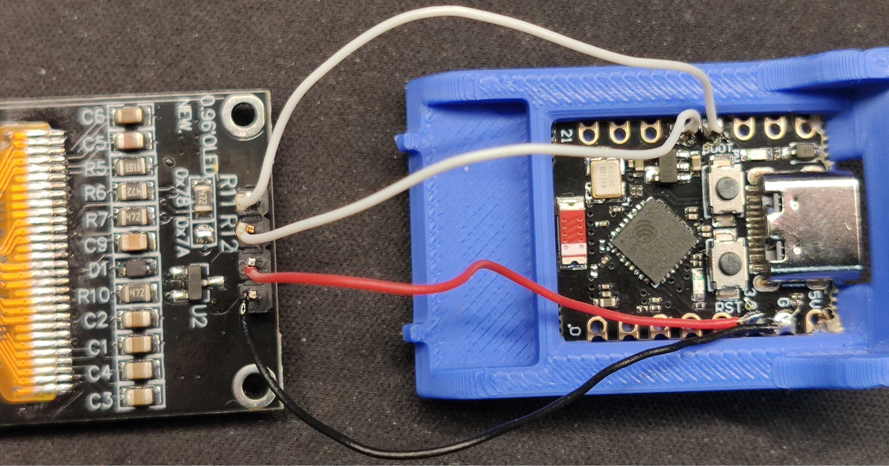
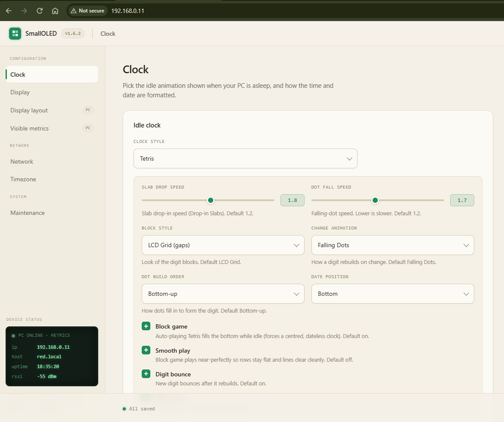
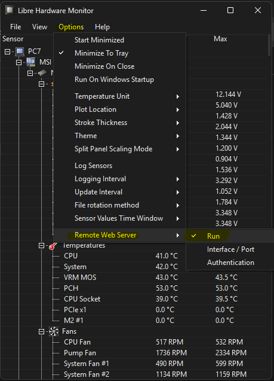
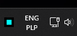
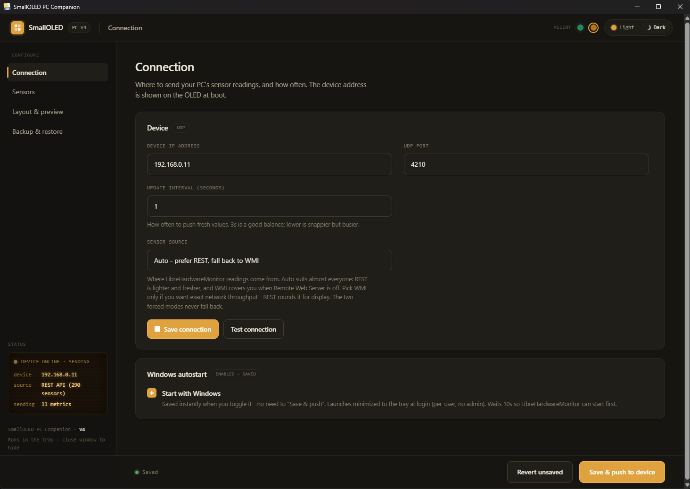
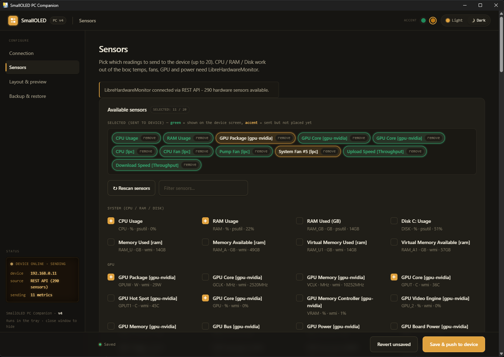
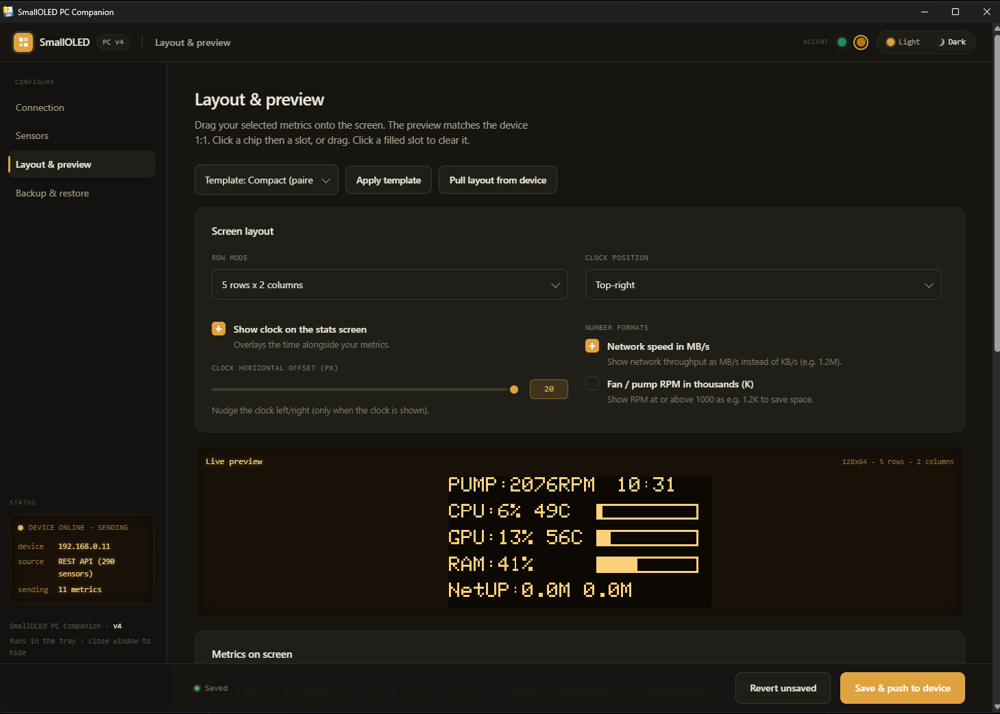
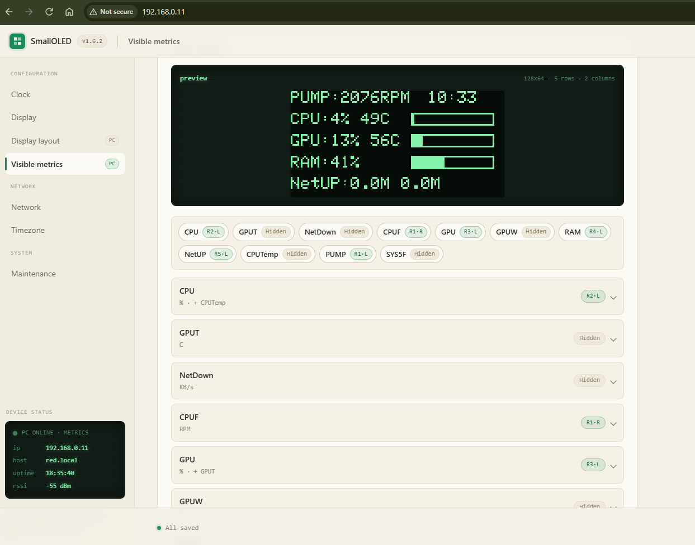

# PC Stats Monitor - ESP32 OLED Display

[](https://www.youtube.com/watch?v=D6zZIyOvWjY)

3D Printable case:
0.96": https://makerworld.com/en/models/2051935

1.3": https://makerworld.com/en/models/2185211

2.42" https://makerworld.com/en/models/2341351

Be aware that there are different sizes of the same SSD1306 (0.96") OLED screen on aliexpress.
Im using this one "Original" version (do not purchase dual color, it won't work):
It seems that there is also "New" screen version which comes in another 2 sizes. So be sure to pick correct 3D printable case from link above.
https://aliexpress.com/item/1005006262908701.html

For 1.3" OLED (SH1106) I have used this version:
https://aliexpress.com/item/1005009757205826.html

For 2.42" OLED (SSD1309) I have used this version:
https://aliexpress.com/item/4000002579405.html

For 1.54" OLED (CH1116) I have used this version:
https://aliexpress.com/item/1005006579037427.html

ESP32-C3 SuperMini:
https://aliexpress.com/item/1005008988143743.html

HOW TO Video assembly (you can ignore LED if you are not going to use it):

Version with LED based on 2n2222: https://www.youtube.com/watch?v=umV7xA0mp5I

Version with LED based on LDO6AJSA https://www.youtube.com/watch?v=M2Oa4PDUUgE


I have noticed that some of the cheap ESP32-C3 boards have WiFi related issues on hardware level. After some additional implementations to the code in attempt to fix issues (v1.2.1), some of those issues cannot be fixed as they are on hardware level.
What has helped a bit: Soldering 2 pins to the side of antenna. Check video assembly where I'm sixing that issue.
Some of those faulty boards have antenna too close to other components. Like in this example (left side with 3.5mm gap is better)


> **Note:** Some ESP32-C3 SuperMini boards (especially the external antenna variant) have a very bright built-in RGB LED (WS2812) on GPIO 8. Since GPIO 8 is used for I2C SDA, this LED cannot be turned off via software. If it bothers you, desolder the LED or cut its data trace on the PCB.

A real-time PC monitoring system that displays CPU, RAM, GPU, and disk stats on a small OLED screen using ESP32 and a companion Python script.

## Custom PCB, sponsored by PCBWay

There is now a 27 x 27 mm carrier PCB that holds the ESP32-C3 SuperMini, the OLED header and the optional filament LED driver on one board, instead of wiring it by hand. **[PCBWay](https://www.pcbway.com/) sponsored this project and manufactured the boards**, SMT assembly included, shown below and in the assembly video.


- **[Board details and build notes](CARRIER-PCB.md)**
- **[Order the board from PCBWay](https://www.pcbway.com/project/shareproject/SmallOLED_Carrier_27x27_mm_ESP32_C3_SuperMini_board_for_an_I2C_OLED_PC_stats_m_c42149ed.html)** (gerbers, BOM and pick and place files are attached to the shared project)
- **[Full assembly video](https://youtu.be/5O7uISlaXd4)**: flashing from the browser, soldering, antenna mod and enclosure
- **Cases for this board**: [0.96" (3MF)](case/SmallOLED-Case-0.96-PCB.3mf) and [1.3" retro (3MF)](case/SmallOLED-Case-1.3-Retro-PCB.3mf), two plates each. See [CARRIER-PCB.md](CARRIER-PCB.md#3d-printed-cases) before printing the 1.3" one, it needs a panel-mount USB-C on a lead

## Features

- **Dual Display Modes:**
  - **PC Online**: Real-time stats with customizable metrics and positions
  - **PC Offline**: Animated clock (Mario, Space Invaders, Arkanoid, Pac-Man, Snake, Tetris, Asteroids, Dino Runner, TRON, Standard, or Large styles, plus a Cycle All mode)
- **Audio Visualizer**: Live spectrum bars or an oscilloscope driven by whatever your PC is playing, streamed by the companion app
- **PC Companion App (v4, Windows + Linux)**:
  - Web-style config window that mirrors the device portal 1:1
  - Live 1:1 OLED preview with drag-and-drop layout
  - Sensor picker with live values, up to 20 metrics
  - Custom labels (max 10 characters), number formats, quick templates
  - Optional audio visualizer stream, with auto-switch when music starts
  - Runs in a native window + system tray; **Start with Windows** autostart
  - Windows prebuilt exe (no Python) or Linux from source
- **Web Configuration Portal**: Customize all settings via browser
  - 5-row (spacious) or 6-row (compact) display modes
  - Large 2-row and 3-row modes for readability at a distance
  - Progress bars for visual representation
  - Clock styles and animation settings
  - Automatic timezone with DST support (56 regions)
  - Display brightness control and scheduled night dimming
  - Export/Import configuration
  - OTA firmware updates
- **Browser Web Flasher (Preferred)**: Install firmware and push WiFi credentials entirely from the browser over USB - no tools to install
- **WiFi Portal**: Easy first-time setup without code changes (fallback / build-from-source path)
- **mDNS Discovery**: Access your device via `http://smalloled.local` (configurable name)
- **Optimized Performance**: Minimal CPU usage on PC (<1%)
- **Persistent Settings**: All preferences saved to ESP32 flash memory

## Quick Start for Beginners

**Never done this before? Here's the simple version:**

1. **Flash ESP32** - Open the [SmallOLED Web Flasher](https://smalloled.stolaris.dev/) in desktop Chrome or Edge, pick your OLED, and click Install (no installation needed!)
2. **Connect ESP32 to WiFi** - Right after flashing, use the flasher's **Configure WiFi** step to send your network to the device over USB. (No web flasher? Join the "PCMonitor-Setup" network and open 192.168.4.1.)
3. **Install LibreHardwareMonitor** (Windows only) - Download from [GitHub](https://github.com/LibreHardwareMonitor/LibreHardwareMonitor/releases), run as Admin (needed for temps/fans/GPU/power)
4. **Get the companion app (v4 - recommended on both Windows and Linux):**
   - **Windows (easiest):** download `pc_stats_monitor_v4.exe` from the [latest release](https://github.com/Keralots/SmallOLED-PCMonitor/releases/latest) and double-click it - no Python needed. v4 gives a polished **web-style config window** (1:1 device preview, drag-and-drop layout, sensor picker, number formats, quick templates) that lives in the system tray. On the first run Windows SmartScreen may say *"Windows protected your PC"* - the exe is unsigned, so click **More info -> Run anyway**. This is normal for small unsigned tools.
   - **Linux:** `cd PC-Companion-App-v4/linux-companion`, then `python3 -m pip install -r requirements.txt` and `python3 pc_stats_monitor_v4_linux.py` (no build step). Same UI; opens a native window or your browser.
5. **Configure in GUI** - Enter ESP32 IP address, select the sensors you want, click "Save & Start"
6. **Position metrics** - use the app's **Layout & preview** page, or open the ESP32 IP in a browser and drag metrics on the device's own preview

Done! Your PC stats will now appear on the OLED display.

For detailed instructions, keep reading below.

## Hardware Requirements

### ESP32 Setup
- **ESP32-C3 Super Mini** (or compatible ESP32 board)
- **OLED Display** (128x64, I2C):
  - SSD1306 0.96" (most common)
  - SH1106 1.3" (larger, recommended)
  - CH1116 1.54" (SH1106-compatible, own firmware)
  - SSD1309 2.42" (largest, uses same firmware as 0.96")
- **TTP223 Touch Sensor** (optional - for physical button control)
- **Wiring (I2C):**
  - SDA → GPIO 8
  - SCL → GPIO 9
  - VCC → 3.3V
  - GND → GND
  - TTP223 Signal → GPIO 7 (optional)
  - LED Transistor Base or LDO6AJSA PWM → GPIO 1 (optional)




### Touch Button (Optional)
##### Wiring for optional filament led and TTP223 sensor

This wiring is for 2.42" OLED. Use the same firmware as for 0.96" OLED for flashing.
No need to change firmware, TTP223 and LED will work.

If you are using 2N2222 and resistors for led here is the wiring:


If you are using LDO6AJSA here is the wiring:


The firmware supports an optional **TTP223 capacitive touch sensor** for physical control of the display and LED night light:

**Button Gestures:**

| Gesture | Duration | Action |
|---------|----------|--------|
| Quick tap | < 500ms | **PC online:** Toggle metrics/clock. **PC offline:** Cycle clock styles |
| Medium press | 500ms-1s, release | Toggle LED night light on/off |
| Long hold | > 1s, keep holding | Ramp LED brightness up (if off) or down (if on). Release to keep. |

**Hardware Setup:**
- Connect TTP223 signal pin to GPIO 7
- Power the TTP223 with 3.3V and GND

**Configuration** (in `src/config/user_config.h`):
```cpp
#define TOUCH_BUTTON_ENABLED 1      // 1 = enabled, 0 = disabled
#define TOUCH_BUTTON_PIN 7          // GPIO pin (default: 7)
#define TOUCH_DEBOUNCE_MS 50       // Debounce delay (default: 100ms)
#define TOUCH_ACTIVE_LEVEL HIGH     // HIGH for TTP223 (active HIGH)
```

## Software Setup

### 1. ESP32 Firmware

#### Option A: SmallOLED Web Flasher (Preferred - No Installation Needed)

A dedicated browser flasher that picks the right firmware for your OLED, installs it over USB, and then hands your WiFi to the device in the same tab. No separate flashing tool and no captive portal needed.

1. Open the **[SmallOLED Web Flasher](https://smalloled.stolaris.dev/)** in desktop **Chrome or Edge** (Web Serial is required, so Firefox, Safari and mobile won't work).
2. Connect your ESP32-C3 via USB. If it constantly connects/disconnects, hold the **BOOT** button, connect to USB while still holding it, then release after connecting. Alternatively, hold **BOOT**, press **RESET** while holding **BOOT**, then release both buttons.
3. Pick your OLED (0.96" SSD1306, 1.3" SH1106, 1.54" CH1116, or 2.42" SSD1309) and click **Install**. It erases and writes the full image at `0x0` in ~30 seconds.
4. When the install finishes, use the **Configure WiFi** step to send your home network to the device over USB. If you miss it, join the **PCMonitor-Setup** hotspot and open `192.168.4.1` instead.
5. The device reboots, joins your WiFi, and shows its IP address on the OLED.

> The same page has a built-in serial monitor (section 04) for grabbing boot logs if you ever need them for a bug report.

#### Option B: Manual Pre-built Binary (Optional)

Prefer to flash the raw binary with your own tool? Download it from the latest release and flash the full image at `0x0`.

**Download the latest release**: grab the full image for your OLED size from the [Releases tab](https://github.com/Keralots/SmallOLED-PCMonitor/releases/latest).

**Generic web flasher (esptool-js):**
1. Visit [ESP Web Flasher](https://espressif.github.io/esptool-js/)
2. Connect your ESP32-C3 via USB (use the BOOT/RESET trick above if it won't stay connected).
3. Click **"Connect"** and select your port
4. Click **"Choose File"** and select the full image for your display, e.g. `firmware-<version>-OLED_0.96inch.bin`
5. Make sure you pick firmware for correct OLED size version! It may initially work but you will get black screen after you reconnect device.
6. Set **Flash Address** to `0x0`
7. Click **"Program"** and wait ~30 seconds
8. Done! Then set up WiFi via the **PCMonitor-Setup** hotspot (see below).

**Other methods:**
- **Windows**: Run `flash.bat` and follow prompts
- **Linux/Mac**: Run `./flash.sh` and follow prompts
- **Manual**: `esptool.py --chip esp32c3 --port COM3 --baud 460800 write_flash 0x0 firmware-<version>-OLED_0.96inch.bin`

#### Option C: Build from Source

**Prerequisites:**
- [PlatformIO](https://platformio.org/) (or Arduino IDE)

**Installation:**
1. Clone this repository
2. Open the project in PlatformIO
3. Connect your ESP32 via USB
4. Build and upload:
   ```bash
   pio run --target upload
   ```

#### First-Time WiFi Setup

> Flashed with the SmallOLED Web Flasher (Option A)? You can skip this - set WiFi from the browser's **Configure WiFi** step right after flashing. The access-point method below is the fallback, and the path when you build from source.

1. After uploading, the ESP32 will create a WiFi access point
2. Connect to the network: **PCMonitor-Setup**
3. Open your browser to `192.168.4.1`
4. Configure your WiFi credentials
5. The ESP32 will connect and display its IP address on the OLED

#### Web Configuration Portal
Once connected to WiFi, access the full configuration page:
1. Open a browser and navigate to the ESP32's IP address (shown on OLED) or `http://smalloled.local`



2. **Clock Settings:**
   - Idle clock style (Mario, Space Invaders, Arkanoid, Pac-Man, Snake, Tetris, Asteroids, Dino Runner, TRON, Standard, or Large, plus a Cycle All mode)
   - Time format (12/24 hour)
   - Date format (DD/MM/YYYY, MM/DD/YYYY, or YYYY-MM-DD)

3. **Display Layout:**
   - Choose between 5-row (spacious, 13px) or 6-row (compact, 10px) modes
   - Large 2-row and 3-row modes for double-size text
   - Enable progress bars for visual representation
   - Row 6 positions automatically hidden in 5-row mode
4. **Timezone:**
   - Select your region from 56 timezone presets
   - Automatic DST transitions (no manual toggle needed)
5. **Visible metrics (custom labels & placement):**
   - Give each metric a custom label (max 10 chars) shown on the OLED - e.g. relabel a pump RPM sensor as "PUMP", "FAN" or "COOLER"
   - Drag a metric chip onto the live OLED preview (or tap a chip then a slot) to place it
   - Pair two metrics on one row and add progress bars
   - Labels can also be set from the companion app
6. **Configuration:**
   - Export configuration to JSON file (backup)
   - Import configuration from JSON file (restore)
   - Reset to factory defaults

### 2. PC Stats Sender

> **Recommended (v4, Windows + Linux):** the v4 companion gives a web-style
> config window that mirrors the device portal 1:1 - live OLED preview, drag-and-drop
> layout, sensor picker, number formats, quick templates, pull/push and backup -
> all from the desktop, hosted in a native window + system tray.
> - **Windows:** prebuilt **`pc_stats_monitor_v4.exe`** on the [latest release page](https://github.com/Keralots/SmallOLED-PCMonitor/releases/latest) - no Python needed. First run may trip Windows SmartScreen (unsigned exe): **More info -> Run anyway**. Source and the full guide live in [`PC-Companion-App-v4/win-companion/`](PC-Companion-App-v4/win-companion/).
> - **Linux:** run from source in [`PC-Companion-App-v4/linux-companion/`](PC-Companion-App-v4/linux-companion/) (`pip install -r requirements.txt` then `python3 pc_stats_monitor_v4_linux.py`).

#### Installing Python (only if you run from source)

The Windows exe bundles its own Python, so skip this unless you run the app from source (always the case on Linux).
For Windows download [e.g. this version](https://www.python.org/ftp/python/3.14.2/python-3.14.2-amd64.exe)
Check both checkboxes on installation screen (to use admin rights and add python.exe to PATH)


At the end of installation, if asked to remove characters limit for path, agree on it.

#### Installing LibreHardwareMonitor
1. Download from [LibreHardwareMonitor](https://github.com/LibreHardwareMonitor/LibreHardwareMonitor/releases)
2. Extract and run `LibreHardwareMonitor.exe` as Administrator
3. Windows defender may block it from running. This is false/positive, just add it to exception.
4. Check following options. First 4 from the top:


For version 0.9.5 and above check Web server option:


LibreHardwareMonitor 0.9.5+ broke its WMI backend. The companion app detects that and falls back to the REST API, which is what the Web server option above serves - so on 0.9.5+ that option is not optional.


#### Set up the companion app

The recommended **v4 companion** (Windows exe or Linux from source, see above) opens its config window automatically and also lives in the system tray - right-click the tray icon to reopen it or quit.



##### Step 1: Launch the app

**Windows:** double-click `pc_stats_monitor_v4.exe`. First run may trip Windows SmartScreen (unsigned exe): **More info -> Run anyway**.

**Linux:**
```bash
cd PC-Companion-App-v4/linux-companion
python3 -m pip install -r requirements.txt
python3 pc_stats_monitor_v4_linux.py
```

##### Step 2: Connect to your ESP32



On the **Connection** page:

1. **Enter the ESP32 IP Address** - shown on the OLED at boot.
2. **UDP Port** (default 4210) and **Update Interval** (default 3s) - leave unless you changed them.
3. **Sensor source** - leave on **Auto** (prefers the REST API, falls back to WMI). Only force a mode if you have a reason to.
4. Click **Test connection** to confirm the device answers, then **Save connection**.
5. **Autostart (optional).** On Windows, tick **Start with Windows** - saved instantly, launches minimized to the tray at login (per-user, no admin) and waits 10s for LibreHardwareMonitor to come up first. On Linux, `python3 pc_stats_monitor_v4_linux.py --autostart enable` installs a `smalloled-companion.service` systemd user unit (`--autostart disable` removes it).

##### Step 3: Pick the sensors to display



On the **Sensors** page:

1. Make sure **LibreHardwareMonitor is running** (Windows) for temps, fans, GPU and power - CPU / RAM / Disk work out of the box. In **Auto** source mode the app reads LibreHardwareMonitor over its REST API and falls back to WMI, so 0.9.5+ (with broken WMI) works fine.
2. Browse the categories: System, Temperatures, Fans, Loads, Clocks, Power, Network Data, Network Throughput. Hit **Rescan sensors** if something is missing.
3. **Live current values** are shown next to each sensor so you can identify them.
4. Tick the sensors you want - up to **20 metrics**.
5. Give any sensor a **Custom label** (max 10 chars) to show on the OLED - e.g. relabel a pump RPM sensor "PUMP". Leave empty for the auto name.
6. Click **Save & push to device**. The **Layout & preview** page then lets you drag each metric onto a 1:1 OLED preview.

##### Step 4: Position Metrics on ESP32 Display



After the companion app starts sending data (arrange metrics in its **Layout & preview** page, or in the device's own web portal as below):

1. Open your ESP32's IP address in a web browser
2. Open the **Visible metrics** page
3. You'll see all metrics received from your PC as draggable chips under a live OLED preview
4. Drag a chip onto a slot (or tap a chip then a slot) to place it; optionally pair it with a companion metric. E.g. **"CPU: 10% 40C"** > shows usage and temperature of CPU.
5. Use **progress bars** for visual representation (optional)
6. Choose between **5-row** (more spacing), **6-row** (compact) or the **large 2/3-row** display modes on the Display layout page

**TIP:** Start with 1-2 metrics initially and slowly build entire layout.



The display will update in real-time as you arrange metrics!

## Usage

### Normal Operation
1. **ESP32** should be powered and connected to WiFi
2. **LibreHardwareMonitor** must be running on your PC
3. **Companion app** should be running

The OLED will display:
- **PC Online**: Real-time stats (CPU, RAM, GPU temp, disk, fan speed)
- **PC Offline**: Animated clock (choose from 11 styles in the web portal, or a Cycle All mode that rotates through them)

### Display Modes

**When PC is Online (receiving stats):**

There are four stats layouts, switchable in the web portal under **Display layout**. All of them take custom labels, paired companion metrics and progress bars. Each clip below runs the same workload cycle - idle, load, cool down - so you can compare them.

| | |
|:---:|:---:|
| <br>**5 rows** - 13px spacing, positions 0-9. The default, and the easiest to read. | <br>**6 rows** - 10px spacing, positions 0-11. One more row of metrics. |
| <br>**Large 3 rows** - double-size text, single column, 3 metrics. | <br>**Large 2 rows** - double-size text, 2 metrics, readable across a room. |

- Real-time monitoring display with customizable labels
- Shows CPU usage/temp, RAM usage, GPU temp, Disk usage, Fan/Pump speed
- Progress bars for visual representation
- The 5-row mode drops to 11px spacing when the clock is centered, to keep all five rows on screen
- Automatically switches when PC sends data

**When PC is Offline (idle mode):**

Every clock below is captured at the 09:59 -> 10:00 rollover, the busiest case, since all four digits change at once.

| | | |
|:---:|:---:|:---:|
| <br>**Mario** | <br>**Space Invaders** | <br>**Arkanoid** |
| <br>**Pac-Man** | <br>**Snake** | <br>**Tetris** |
| <br>**Asteroids** | <br>**Dino Runner** | <br>**TRON** |
| <br>**Standard** | <br>**Large** | |

- **Mario Clock**: Animated pixel Mario that jumps to "hit" digits when time changes
- **Space Invaders Clock**: Invader/ship shoots lasers to change digits
- **Arkanoid Clock**: Breakout-style ball physics destroy and rebuild digits
- **Pac-Man Clock**: Pac-Man eats pellet-based digits
- **Snake Clock**: A Nokia-style snake roams the screen chasing food and steering around the digits and its own body. On each minute change the changed digits crumble into pellets that the snake hunts down one by one before the new digit drops in. Optional arena border and date row.
- **Tetris Clock**: Block-grid digits sit low on the screen with the occasional tumbling tetromino. On each minute change the changed digits are rebuilt one at a time, either as drop-in slabs or as falling dots. Optional date row at the top or bottom.
- **Asteroids Clock**: A wireframe vector clock - the ship drifts with inertia and splits tumbling rocks while idle, then aims at and shoots each changed digit into spinning line shards at the minute change. Optional date row.
- **Dino Runner Clock**: A Chrome T-Rex homage - the dino runs and auto-jumps cacti over a scrolling ground with parallax clouds; at the minute change a pterodactyl swoops in, carries off the old digit, and the new one drops in from above. Optional clouds and date row.
- **TRON Clock**: Two light cycles duel around the digits, leaving trails behind them (one solid, one dotted, so you can tell them apart). At the minute change one cycle is dispatched to retrace the changed digit stroke by stroke. Optional arena grid and border, and a choice of side-profile or overhead bike sprite.
- **Standard Clock**: Simple centered clock with date and day of week
- **Large Clock**: Extra-large time display with date
- **Cycle All Styles**: Rotates through every clock style automatically, switching every 5 minutes.

Change clock style anytime via the web portal or touch button!

### Customizing Display Labels

**Via Web Portal (Recommended):**
1. Open ESP32's IP address in browser
2. Go to the **Visible metrics** page
3. Expand a metric and set its **Custom label** to match your setup:
   - relabel a pump RPM sensor "PUMP", "FAN" or "COOLER"
   - give CPU, RAM, GPU, Disk metrics your own labels too
4. Changes apply live in the preview; click **Save & apply** to keep them

### Customizing Monitored Sensors

The companion app lets you select any sensor available on your system:

**Available Sensor Categories:**
- **System Metrics**: CPU%, RAM%, Disk usage (using psutil)
- **Temperatures**: CPU cores, GPU, motherboard, drives
- **Fans & Cooling**: All detected fan speeds
- **Loads**: CPU/GPU load percentages
- **Clocks**: CPU/GPU clock speeds
- **Power**: Power consumption sensors
- **Network Data**: Total uploaded/downloaded (in GB)
- **Network Throughput**: Current upload/download speeds (in KB/s or MB/s)

**How to Select Sensors:**
1. Make sure **LibreHardwareMonitor is running** (Windows) for temps/fans/GPU/power. The app falls back to its REST API on 0.9.5+.
2. Open the companion app - double-click `pc_stats_monitor_v4.exe`, or right-click the tray icon and choose open
3. Go to the **Sensors** page and browse the categories
4. **Live current values** are shown next to each sensor to help you identify them
5. Tick the sensors you want to monitor (up to 20)
6. Set custom labels if desired (max 10 characters)
7. Click **Save & push to device** - the OLED updates live


**Tips:**
- The GUI shows live sensor values when you open it
- Use the search box to quickly find specific sensors
- Network metrics automatically distinguish between upload and download
- You can select up to 20 different metrics
- Labels set in the companion app override the default names on the ESP32

## Audio Visualizer

The display can show what your PC is playing: 32 spectrum bars or an
oscilloscope trace, updated about 25 times a second.

| | | |
|:---:|:---:|:---:|
| <br>**Classic EQ** | <br>**Mirror EQ** | <br>**Oscilloscope** |

This is a **forced mode**, not a clock style. It needs a live audio stream, so
it is switched on deliberately rather than sitting in the clock rotation, and it
drops back to your normal screen about 10 seconds after the audio stops.

### Turning it on

1. **In the companion app** (Connection page), tick **Audio visualizer stream**.
   The companion captures whatever your PC is playing (WASAPI loopback on
   Windows, PulseAudio monitor on Linux) and sends it to the same UDP port the
   stats already use.
   - Windows: no extra setup.
   - Linux / running from source: needs `soundcard` and `numpy`
     (`pip install soundcard numpy`). The app tells you if they are missing.
2. **Show it on the device**, in any of three ways:
   - Tick **Start the visualizer when music plays** in the companion, and it
     switches the display for you once sound has been playing for the start
     delay, then hands the display back after the quiet period.
   - Press **Show visualizer** on the device's *Audio visualizer* page.
   - Tap the touch button while audio is playing. Tap again to leave.

If the panel says *"No audio data..."*, the device is in visualizer mode but no
stream is arriving - check the companion is running with the stream enabled.

### Settings (device web portal, *Audio visualizer* page)

| Setting | What it does |
|---|---|
| **Visualizer** | Classic EQ (bars from the bottom), Oscilloscope, or Mirror EQ (bars split around a centre line) |
| **Bar texture** | Solid, Segmented (a dark row every third row - reads as an LED ladder), or Outline |
| **Frame rate** | 15-60. See the note below |
| **Peak hold** | A marker that hangs at each band's last peak and falls back under gravity |
| **Corner clock** | Small HH:MM in the top right; costs the top 12 rows |
| **Vertical gain** | Oscilloscope trace height, 50-200% |
| **Ghost trace** | Dotted echo of the previous waveform |
| **Graticule** | Oscilloscope grid. Off by default - it is the same white as the trace, so it competes with it |
| **Fill to centre** | Fills between trace and centre line; goes solid when loud |

**About the frame rate.** These OLED controllers have no double buffering: the
firmware writes straight into the panel's memory while the panel is scanning it
out. Drawing faster than the panel can show it does not look smoother, it looks
torn. The whole 1024-byte framebuffer also has to cross the I2C bus every frame,
which on the stock 400 kHz bus measures **37 fps on a 0.96" SSD1306** and
**33 fps on a 1.3" SH1106** - so those are the real ceilings, whatever the
setting says. The 30 fps default sits comfortably below both. Raise it if you
want; if the picture tears, come back down.

Advanced users can raise the bus itself with `DISPLAY_I2C_CLOCK` in
`src/config/user_config.h` (default `400000`). 800 kHz roughly halves the
transfer time, but it is above what these controllers are specified for and
some panels or longer wiring will corrupt the image rather than fail cleanly.
Change it only if you can watch the panel while you test.

### Oscilloscope needs a recent companion

The waveform is an extra 128 bytes appended to each packet. An older companion
sends only the spectrum, and the oscilloscope will say *"Update PC companion
for the waveform"*. The bar styles work with either.

## HTTP Control API

The firmware exposes a small set of HTTP endpoints for remote control and home automation (e.g. Home Assistant, Node-RED, or a simple `curl` from a script). This is handy for **turning the display off while you're away to extend OLED lifetime**, forcing the clock display, dimming on your own schedule, or rebooting the device remotely.

All endpoints are plain **HTTP GET** (easy to call from any tool), return JSON, and have **no authentication** - anyone on your local network can call them, so keep the device on a trusted LAN.

> **Note:** These controls are **runtime-only** - they are *not* saved to flash and reset to your normal configured behavior after a reboot or power cycle. This is intentional: it avoids flash wear from automations toggling frequently, and lets an external scheduler own the state. To change defaults permanently, use the web configuration portal.

Replace `smalloled.local` in the examples with your device's mDNS name (configurable) or its IP address.

### Endpoints

| Method | Endpoint | Description |
|--------|----------|-------------|
| GET | `/api/status` | Return current display/mode state as JSON |
| GET | `/api/display/off` | Turn the display off (panel powered down) |
| GET | `/api/display/on` | Turn the display back on |
| GET | `/api/display/brightness?value=0-100` | Set display brightness (percent) |
| GET | `/api/mode/clock` | Force the animated clock, even when the PC is online |
| GET | `/api/mode/auto` | Resume automatic mode (PC stats when online, clock when offline) |
| GET | `/api/clock/style?id=<id>` | Switch the clock animation |
| GET | `/api/mode/viz` | Show the audio visualizer (needs the companion's audio stream) |
| GET | `/api/viz/style?id=0-2` | Switch the visualizer style |
| GET | `/api/reboot` | Soft-restart the device (does **not** erase settings) |

**Clock style IDs:** `0` = Mario, `1` = Standard, `2` = Large, `3` = Space Invaders, `5` = Arkanoid/Pong, `6` = Pac-Man, `7` = Snake, `8` = Tetris, `9` = Cycle All Styles, `10` = Asteroids, `11` = Dino Runner, `16` = TRON. (The ids are a fixed set, not a range - the gaps are reserved so style numbers stay aligned with the sister project.)

**Visualizer style IDs:** `0` = Classic EQ, `1` = Oscilloscope, `2` = Mirror EQ.

### Examples

```bash
# Turn the display off (e.g. when leaving home) and back on
curl http://smalloled.local/api/display/off
curl http://smalloled.local/api/display/on

# Dim the display to 30%
curl "http://smalloled.local/api/display/brightness?value=30"

# Always show the clock, then go back to automatic
curl http://smalloled.local/api/mode/clock
curl http://smalloled.local/api/mode/auto

# Switch to the Pac-Man clock
curl "http://smalloled.local/api/clock/style?id=6"

# Show the audio visualizer, then pick the oscilloscope
curl http://smalloled.local/api/mode/viz
curl "http://smalloled.local/api/viz/style?id=1"

# Check current state
curl http://smalloled.local/api/status
```

A `/api/status` response looks like:

```json
{
  "displayOn": true,
  "forcedOff": false,
  "mode": "clock",
  "forcedClock": true,
  "brightness": 100,
  "clockStyle": 0,
  "pcOnline": false
}
```

| Field | Meaning |
|-------|---------|
| `displayOn` | `false` when the panel is off (forced off, or brightness 0) |
| `forcedOff` | `true` if the display was turned off via `/api/display/off` |
| `mode` | `"metrics"` or `"clock"` - what is currently being shown |
| `forcedClock` | `true` if clock mode is being forced via `/api/mode/clock` |
| `brightness` | Current brightness, 0-100% |
| `clockStyle` | Active clock style ID (see list above) |
| `pcOnline` | `true` if the PC sender is currently sending stats |

### Home Assistant example

Add this to your `configuration.yaml` to expose the display on/off controls as commands:

```yaml
rest_command:
  oled_display_off:
    url: "http://smalloled.local/api/display/off"
  oled_display_on:
    url: "http://smalloled.local/api/display/on"
```

You can then call `rest_command.oled_display_off` / `oled_display_on` from an automation - for example, turn the display off when everyone leaves home and back on when someone arrives.

## Troubleshooting

### ESP32 Issues

**Display not working**
- Check I2C wiring (SDA=GPIO8, SCL=GPIO9)
- Verify I2C address is 0x3C (common for SSD1306)
- For SH1106 (1.3"): change `DEFAULT_DISPLAY_TYPE` to `1` in `user_config.h`
- For CH1116 (1.54"): change `DEFAULT_DISPLAY_TYPE` to `2` in `user_config.h`
- For SSD1309 (2.42"): use `DEFAULT_DISPLAY_TYPE` `0` (same as 0.96", no change needed)

**Can't connect to WiFi portal**
- Make sure you're connected to "PCMonitor-Setup" network
- Try accessing `192.168.4.1` in your browser
- Reset WiFi settings via web interface

**ESP32 keeps restarting**
- Check power supply (use quality USB cable)
- Monitor serial output at 115200 baud for error messages

### Companion App Issues

**The config window doesn't open**
- Windows: the exe is unsigned, so SmartScreen may hold it on the first run - **More info → Run anyway**. Once it is running, right-click the tray icon to reopen the window.
- Linux: a native window needs the system GTK/WebKit libraries (`sudo apt install gir1.2-webkit2-4.1 python3-gi`). Without them the app still runs and serves the same UI in your browser at `http://127.0.0.1:8737`.

**Hardware sensor errors (Windows)**
- Make sure **LibreHardwareMonitor is running as Administrator** - without admin it reports no temps, fans or power
- Check that the WMI service is running: `services.msc` → Windows Management Instrumentation

**No sensors showing (Windows)**
- Start LibreHardwareMonitor **before** the companion app, and give it a few seconds
- On LibreHardwareMonitor 0.9.5+, enable Options → Remote Web Server → Run. Its WMI backend is broken; the app falls back to the REST API, which that option serves
- Leave **Sensor source** on **Auto** unless you have a reason to force a mode, then hit **Rescan sensors**

**No data on ESP32 display**
- Verify the ESP32 IP address on the **Connection** page matches the one shown on the OLED, and use **Test connection**
- Check Windows Firewall isn't blocking UDP port 4210
- Ensure both PC and ESP32 are on the same network
- Open the ESP32 web interface and check the **Visible metrics** page - metrics arrive unplaced until you position them

**Autostart not working (Windows)**
- The **Start with Windows** tick box writes an HKCU Run entry; check Task Manager → Startup
- It launches minimized to the tray, so look for the tray icon rather than a window

**Autostart not working (Linux)**
- Check service status: `systemctl --user status smalloled-companion`
- View logs: `journalctl --user -u smalloled-companion -f`
- Make sure systemd is available on your system
- Enable lingering (optional): `loginctl enable-linger $USER`

**Network metrics not showing (Linux)**
- Network metrics use psutil's `net_io_counters()`
- Upload/download speeds are calculated from byte deltas
- First reading will always be 0, wait for next update cycle

**Audio visualizer says "No audio data..."**
- The device is in visualizer mode but nothing is arriving - tick **Audio visualizer stream** on the companion's Connection page
- Linux / running from source also needs `soundcard` and `numpy`, and a PulseAudio/PipeWire monitor source for the default output

**Custom labels not appearing on ESP32**
- Set them on the companion's **Sensors** page (max 10 characters), then **Save & push to device**
- They can also be set per metric in the device's own **Visible metrics** page

## Technical Details

### Communication
- **Protocol**: UDP
- **Port**: 4210 (configurable)
- **Format**: JSON
- **Update Rate**: 3 seconds (configurable in the app)
- **Max Metrics**: 20
- **Audio stream**: same UDP port, ~25 packets/s, spectrum plus an optional 128-byte waveform

### Companion App Internals
- **JSON configuration** in `%APPDATA%\SmallOLED-Companion\monitor_config.json` (Windows) or `~/.config/smalloled-companion/monitor_config.json` (Linux)
- **Dynamic sensor discovery** - detects every sensor the system exposes
- **REST API fallback** - automatic support for LibreHardwareMonitor 0.9.5+ (broken WMI)
- **Network metrics** calculated in real-time (upload/download speeds)
- **Export/Import** configuration for easy backup and sharing
- **Systemd integration** (Linux) for proper service management

### Libraries Used

**ESP32:**
- WiFiManager (tzapu)
- Adafruit SSD1306 / Adafruit SH110X
- Adafruit GFX
- ArduinoJson

**Companion app (Windows):**
- psutil (system stats & network)
- pywin32/wmi (LibreHardwareMonitor integration)
- pywebview (native window hosting the local web UI)
- pystray/pillow (system tray)

**Companion app (Linux):**
- psutil (system stats, temps, fans, network)
- pywebview (native window, falls back to the browser)
- soundcard/numpy (audio visualizer - optional)

### File Structure
```
PC-Companion-App-v4/
  companion-common/     # shared UI, server and protocol code
  win-companion/        # Windows app, source of pc_stats_monitor_v4.exe
  linux-companion/      # Linux app, run from source
monitor_config.json     # per-user config (auto-generated, see path above)
```

## Advanced / Optional Features

These features are **disabled by default** and require recompilation. They are configured in `src/config/user_config.h` and are intended for advanced users who build from source.

### Display Type Selection

Change `DEFAULT_DISPLAY_TYPE` to match your OLED:

| Value | Display | Size | Notes |
|-------|---------|------|-------|
| `0` | SSD1306 | 0.96" / 2.42" | Default. Works for both 0.96" SSD1306 and 2.42" SSD1309 |
| `1` | SH1106 | 1.3" | 132x64 RAM with 2-column offset |
| `2` | CH1116 | 1.54" | SH1106-compatible, no column offset ([example panel](https://aliexpress.com/item/1005006579037427.html)) |

### SPI Display Interface

By default, displays connect via I2C (2 wires). For faster refresh rates (useful for smooth animations), you can use SPI instead.

```cpp
#define DISPLAY_INTERFACE 1          // 0 = I2C (default), 1 = SPI
```

**SPI pin assignments** (ESP32-C3):
| Signal | GPIO | Notes |
|--------|------|-------|
| MOSI (SDA) | 6 | Data |
| SCK | 4 | SPI Clock |
| CS | 5 | Chip Select |
| DC | 3 | Data/Command |
| RST | 10 | Reset (-1 if not connected) |

### LED PWM Night Light

Drive a filament LED (or any LED) via a 2N2222 transistor on GPIO 1. Controlled via TTP223 touch gestures (medium press toggles, long hold ramps brightness with gamma correction).

```cpp
#define LED_PWM_ENABLED 1            // 0 = disabled (default), 1 = enabled
#define LED_PWM_PIN 1                // GPIO pin (default: 1)
```

See the [wiring diagram](img/circuit_image.png) for the transistor circuit.

### QR Code WiFi Setup

Show a scannable QR code on the OLED during WiFi AP setup instead of text instructions. Useful for mobile phone setup.

```cpp
#define QR_SETUP_ENABLED 1           // 0 = text instructions (default), 1 = QR code
```

### BLE WiFi Provisioning (Experimental)

Bluetooth Low Energy setup for the **SmallOLED Android app** (currently in development). Instead of the WiFi AP portal, the ESP32 advertises as a BLE device. The Android app discovers it, sends WiFi credentials over BLE, and the device connects automatically.

```cpp
#define BLE_SETUP_ENABLED 1          // 0 = AP mode (default), 1 = BLE provisioning
#define BLE_DEVICE_NAME "SmallOLED"  // BLE advertised name
```

**How it works:**
1. On first boot (no saved WiFi), device starts BLE advertising
2. Android app scans and finds "SmallOLED"
3. App sends your home WiFi SSID + password over BLE
4. Device connects to WiFi and saves credentials
5. Subsequent boots connect silently (no BLE needed)
6. If BLE times out (2 min) or fails, falls back to AP mode automatically

**Requirements:**
- `min_spiffs.csv` partition table (already set in `platformio.ini`)
- NimBLE library (already included in `platformio.ini`)
- Android app (in development, not yet publicly released)

### Scheduled Display Dimming

Automatically dim the display during nighttime hours. Configured via the web interface under Display Settings:
- **Enable/disable** scheduled dimming
- **Start/end hours** (e.g., 10 PM to 7 AM)
- **Dim brightness level** (0-255)

### OTA Firmware Updates

Upload new firmware wirelessly through the web interface at `http://<device-ip>/update`. No need to physically connect USB after the initial flash.

## License

This project is open source. Feel free to modify and share!

## Credits

Created for monitoring PC stats on a small OLED display. Mario animation inspired by classic pixel art.
